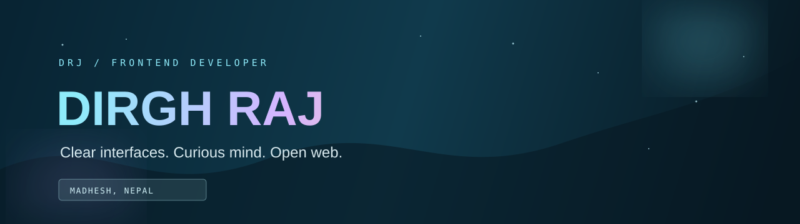
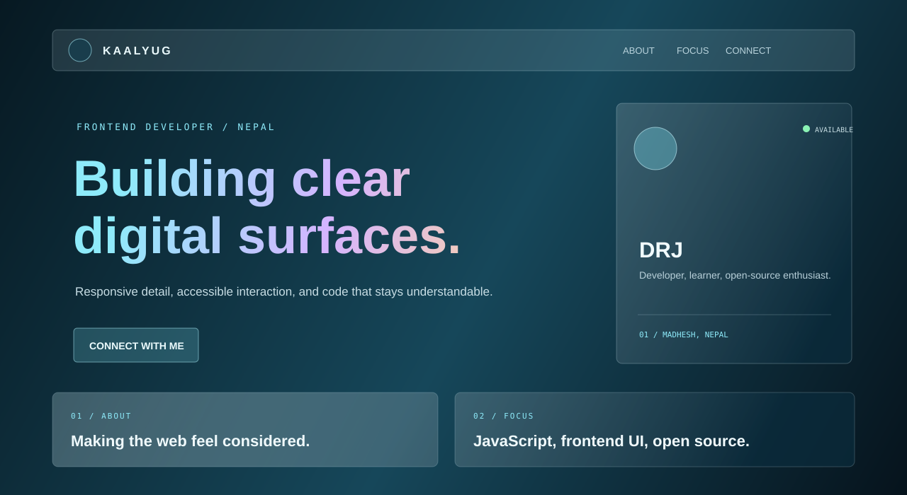

  

  
  
  
  

  
  
  

## Hey, I am DRJ

I am a frontend developer and open-source learner from **Madhesh, Nepal**. I like working where clear visual design meets dependable frontend code. I am building my skills in public, learning through projects, and exploring the people and tools behind the open web.

  

## GitHub Live Preview

  
  

<a href="https://github.com/drj7zz?tab=repositories"><b>Explore my live GitHub projects</b></a>

## Current Focus

<table>
  <tr>
    <td width="33%" align="center"><b>JavaScript</b> Browser fundamentals and interaction.</td>
    <td width="33%" align="center"><b>Frontend UI</b> Responsive layouts and polished details.</td>
    <td width="33%" align="center"><b>Open Source</b> Learning through community and shared tools.</td>
  </tr>
</table>

## Toolkit

  
  
  
  
  
  

## A Little More

- Pursuing a Bachelor of Information Technology (BIT) in Parsa, Nepal
- Interested in accessible UI, clean code, and thoughtful web experiences
- Always looking for a new idea to build or a better way to learn

 

## Connect

 

<i>Always learning. Always building.</i>

